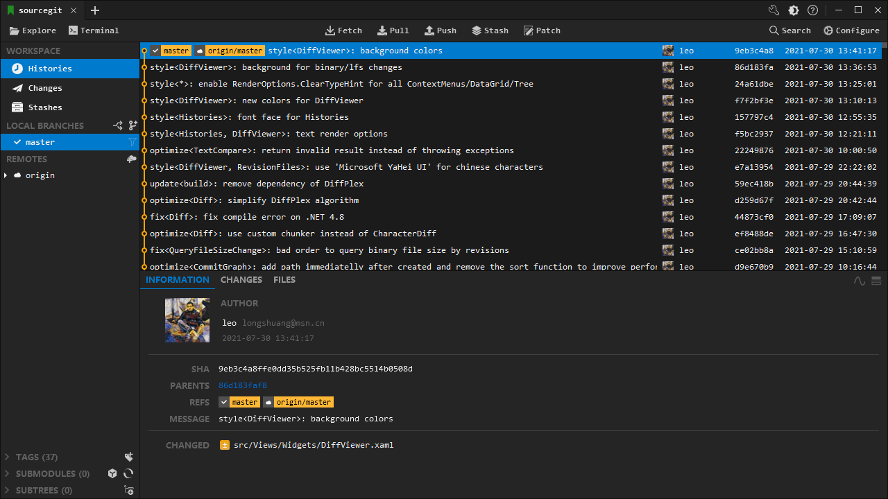
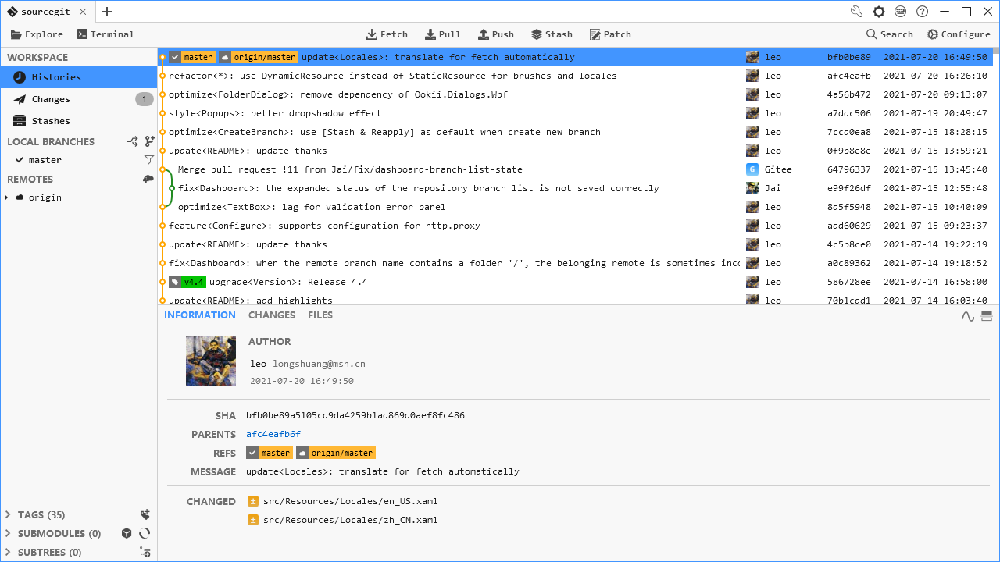

# SourceGit - Opensource Git GUI client.

[](https://github.com/sourcegit-scm/sourcegit/stargazers)
[](https://github.com/sourcegit-scm/sourcegit/forks)
[](LICENSE)
[](https://github.com/sourcegit-scm/sourcegit/releases/latest)
[](https://github.com/sourcegit-scm/sourcegit/releases)

## Screenshots

* Dark Theme

  

* Light Theme

  

* Custom

  You can find custom themes from [sourcegit-theme](https://github.com/sourcegit-scm/sourcegit-theme.git). And welcome to share your own themes.

## Highlights

* Supports Windows/macOS/Linux
* Opensource/Free
* Fast
* Deutsch/English/Español/Bahasa Indonesia/Français/Italiano/Português/Русский/Українська/简体中文/繁體中文/日本語/தமிழ் (Tamil)/한국어
* Built-in light/dark themes
* Customize theme
* Visual commit graph
* Supports SSH access with each remote
* GIT commands with GUI
  * Clone/Fetch/Pull/Push...
  * Merge/Rebase/Reset/Revert/Cherry-pick...
  * Amend/Reword/Squash
  * Interactive rebase
  * Branches
  * Remotes
  * Tags
  * Stashes
  * Submodules
  * Worktrees
  * Archive
  * Diff
  * Save as patch/apply
  * File histories
  * Blame
  * Revision Diffs
  * Branch Diff
  * Image Diff - Side-By-Side/Swipe/Blend
* Git command logs
* Search commits
* GitFlow
* Git LFS
* Bisect
* Issue Link
* Workspace
* Custom Action
* Create PR on GitHub/Gitlab/Gitea/Gitee/Bitbucket...
* Using AI to generate commit message (C# port of [anjerodev/commitollama](https://github.com/anjerodev/commitollama))
* Built-in conventional commit message helper.

> [!WARNING]
> **Linux** only tested on **Debian 12** on both **X11** & **Wayland**.

## Translation Status

You can find the current translation status in [TRANSLATION.md](https://github.com/sourcegit-scm/sourcegit/blob/develop/TRANSLATION.md)

## How to Use

**To use this tool, you need to install Git(>=2.25.1) first.**

You can download the latest stable from [Releases](https://github.com/sourcegit-scm/sourcegit/releases/latest) or download workflow artifacts from [GitHub Actions](https://github.com/sourcegit-scm/sourcegit/actions) to try this app based on latest commits.

This software creates a folder `$"{System.Environment.SpecialFolder.ApplicationData}/SourceGit"`, which is platform-dependent, to store user settings, downloaded avatars and crash logs.

| OS      | PATH                                                |
|---------|-----------------------------------------------------|
| Windows | `%APPDATA%\SourceGit`                               |
| Linux   | `${HOME}/.config/SourceGit` or `${HOME}/.sourcegit` |
| macOS   | `${HOME}/Library/Application Support/SourceGit`     |

> [!TIP]
> * You can open this data storage directory from the main menu `Open Data Storage Directory`.
> * You can create a `data` folder next to the `SourceGit` executable to force this app to store data (user settings, downloaded avatars and crash logs) into it (Portable-Mode). Only works on Windows.

For **Windows** users:

* **MSYS Git is NOT supported**. Please use official [Git for Windows](https://git-scm.com/download/win) instead.
* You can install the latest stable by `scoop` with follow commands:
  ```shell
  scoop bucket add extras
  scoop install sourcegit
  ```
* Pre-built binaries can be found in [Releases](https://github.com/sourcegit-scm/sourcegit/releases/latest)

> [!NOTE]
> `git-flow` is no longer shipped with **Git for Windows** since `2.51.1`. You can use it by following these steps:
>  * Download [git-flow-next](https://github.com/gittower/git-flow-next/releases)
>  * Unzip & Rename the `git-flow-next` to `git-flow`
>  * Copy to `$GIT_INSTALL_DIR/cmd` or just add its path to you `PATH` directly

For **macOS** users:

* Thanks [@ybeapps](https://github.com/ybeapps) for making `SourceGit` available on `Homebrew`:
  ```shell
  brew install --cask sourcegit
  ```
* If you want to install `SourceGit.app` from GitHub Release manually, you need run following command to make sure it works:
  ```shell
  sudo xattr -cr /Applications/SourceGit.app
  ```
> [!NOTE]
> macOS packages in the `Release` page of this project are all unsigned. If you are worried about potential security issues with the above command, you can download the signed package from the [distribution repository](https://github.com/ybeapps/homebrew-sourcegit/releases) provided by [@ybeapps](https://github.com/ybeapps) (there is no need to execute the above command while installing `SourceGit`).

* Make sure [git-credential-manager](https://github.com/git-ecosystem/git-credential-manager/releases) is installed on your mac.
* You can run `echo $PATH > ~/Library/Application\ Support/SourceGit/PATH` to generate a custom PATH env file to introduce `PATH` env to SourceGit.

For **Linux** users:

* Thanks [@aikawayataro](https://github.com/aikawayataro) for providing `rpm` and `deb` repositories, hosted on [Codeberg](https://codeberg.org/yataro/-/packages).

  `deb` how to:
  ```shell
  curl https://codeberg.org/api/packages/yataro/debian/repository.key | sudo tee /etc/apt/keyrings/sourcegit.asc
  echo "deb [signed-by=/etc/apt/keyrings/sourcegit.asc, arch=amd64,arm64] https://codeberg.org/api/packages/yataro/debian generic main" | sudo tee /etc/apt/sources.list.d/sourcegit.list
  sudo apt update
  sudo apt install sourcegit
  ```

  `rpm` how to:
  ```shell
  curl https://codeberg.org/api/packages/yataro/rpm.repo | sed -e 's/gpgcheck=1/gpgcheck=0/' > sourcegit.repo

  # Fedora 41 and newer
  sudo dnf config-manager addrepo --from-repofile=./sourcegit.repo
  # Fedora 40 and earlier
  sudo dnf config-manager --add-repo ./sourcegit.repo

  sudo dnf install sourcegit
  ```

  If your distribution isn't using `dnf`, please refer to the documentation of your distribution on how to add an `rpm` repository.
* `AppImage` files can be found on [AppImage hub](https://appimage.github.io/SourceGit/), `xdg-open` (`xdg-utils`) must be installed to support open native file manager.
* Make sure [git-credential-manager](https://github.com/git-ecosystem/git-credential-manager/releases) or [git-credential-libsecret](https://pkgs.org/search/?q=git-credential-libsecret) is installed on your Linux.
* Maybe you need to set environment variable `AVALONIA_SCREEN_SCALE_FACTORS`. See https://github.com/AvaloniaUI/Avalonia/wiki/Configuring-X11-per-monitor-DPI.
* If you can NOT type accented characters, such as `ê`, `ó`, try to set the environment variable `AVALONIA_IM_MODULE` to `none`.

## OpenAI

This software supports using OpenAI or other AI service that has an OpenAI compatible HTTP API to generate commit message. You need configurate the service in `Preference` window.

For `OpenAI`:

* `Server` must be `https://api.openai.com/v1`

For other AI service:

* The `Server` should fill in a URL equivalent to OpenAI's `https://api.openai.com/v1`. For example, when using `Ollama`, it should be `http://localhost:11434/v1` instead of `http://localhost:11434/api/generate`
* The `API Key` is optional that depends on the service

## External Tools

This app supports open repository in external tools listed in the table below.

| Tool                          | Windows | macOS | Linux |
|-------------------------------|---------|-------|-------|
| Visual Studio Code            | YES     | YES   | YES   |
| Visual Studio Code - Insiders | YES     | YES   | YES   |
| VSCodium                      | YES     | YES   | YES   |
| Cursor                        | YES     | YES   | YES   |
| Sublime Text                  | YES     | YES   | YES   |
| Zed                           | YES     | YES   | YES   |
| Visual Studio                 | YES     | NO    | NO    |

> [!NOTE]
> This app will try to find those tools based on some pre-defined or expected locations automatically. If you are using one portable version of these tools, it will not be detected by this app.  
> To solve this problem you can add a file named `external_editors.json` in app data storage directory and provide the path directly.  
> User can also exclude some editors by using `external_editors.json`.

The format of `external_editors.json`:
```json
{
    "tools": {
        "Visual Studio Code": "D:\\VSCode\\Code.exe"
    },
    "excludes": [
        "Visual Studio Community 2019"
    ]
}
```

> [!NOTE]
> This app also supports a lot of `JetBrains` IDEs, installing `JetBrains Toolbox` will help this app to find them.

## Conventional Commit Helper

You can define your own conventional commit types (per-repository) by following steps:

1. Create a json file with your own conventional commit type definitions. For example:
```json
[
  {
    "Name": "New Feature",
    "Type": "Feature",
    "Description": "Adding a new feature",
    "PrefillShortDesc": "this is a test"
  },
  {
    "Name": "Bug Fixes",
    "Type": "Fix",
    "Description": "Fixing a bug"
  }
]
```
2. Configure the `Conventional Commit Types` in repository configuration window.  

## Contributing

Everyone is welcome to submit a PR. Please make sure your PR is based on the latest `develop` branch and the target branch of PR is `develop`.

In short, here are the commands to get started once [.NET tools are installed](https://dotnet.microsoft.com/en-us/download):

```sh
dotnet nuget add source https://api.nuget.org/v3/index.json -n nuget.org
dotnet restore
dotnet build
dotnet run --project src/SourceGit.csproj
```

Thanks to all the people who contribute.

[](https://github.com/sourcegit-scm/sourcegit/graphs/contributors)

## Third-Party Components

For detailed license information, see [THIRD-PARTY-LICENSES.md](THIRD-PARTY-LICENSES.md).
