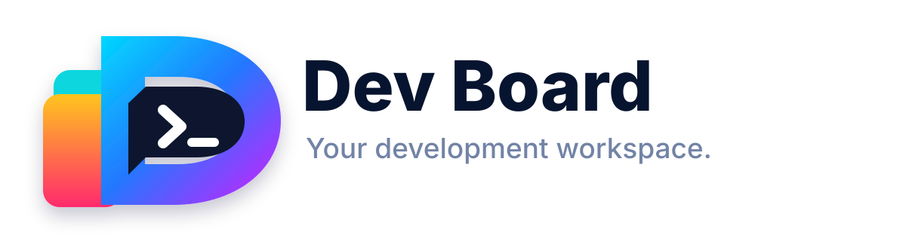
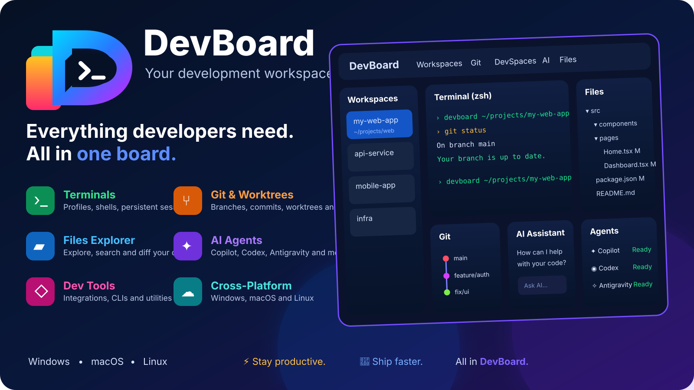

<p align="center">
  
</p>

<p align="center">
  <strong>Workspaces · Git · Worktrees · Terminals · Files · AI Agents</strong><br/>
  Everything you need for day-to-day development, in one board.
</p>

<p align="center">
  
</p>

<p align="center">
  <a href="https://github.com/dhhieu113pro/dev-board/stargazers"></a>
  <a href="https://github.com/dhhieu113pro/dev-board/forks"></a>
  <a href="LICENSE"></a>
</p>

# DevBoard

**DevBoard** is a cross-platform development workspace built around your repositories and worktrees. Git is still a first-class part of the app, but DevBoard goes further: it keeps your terminals, files, DevSpaces, AI coding agents, repository state, and development tools together in the context of the workspace you are actually working in.

Instead of jumping between a Git client, terminal windows, file explorers, worktree folders, and AI CLIs, DevBoard gives each workspace its own persistent development board.

## Why DevBoard?

A repository is more than its Git history. Modern development usually means multiple worktrees, several terminal sessions, code navigation, local tools, and one or more AI agents running against the same workspace.

DevBoard treats the **workspace path** as the center of that experience. Switch worktrees or repository tabs and each workspace can keep its own development state rather than forcing everything into one global terminal or Git view.

## DevSpaces

DevSpaces are persistent, workspace-scoped development sessions.

- **Workspace-aware terminals** — terminals belong to the current repository/worktree path.
- **Persistent state per tab** — move between worktrees without losing the DevSpace you were using.
- **Terminal profiles** — launch the shell or development environment you prefer.
- **AI CLI agents** — launch coding agents directly in the correct workspace.
- **Workspace trust automation** — supported AI CLIs can start against the selected workspace without repetitive trust prompts.
- **Multiple worktrees** — work on several branches in parallel while keeping their development environments separate.

Current built-in AI CLI integrations include **GitHub Copilot CLI**, **Codex CLI**, and **Antigravity CLI**, with the DevSpace architecture designed to grow beyond them.

## Files

DevBoard includes a workspace file experience alongside Git and terminals.

- Explore files and folders in the active workspace.
- Search workspace files quickly.
- Open a file and inspect its contents without leaving the app.
- See Git-aware file state such as added, modified, deleted, and renamed files.
- Inspect added/deleted lines with familiar diff highlighting.
- Keep file/search state scoped to the current worktree tab.

## Git & Worktrees

The mature Git foundation remains a core strength of DevBoard:

- Clone, fetch, pull, push, merge, rebase, reset, revert, and cherry-pick.
- Branches, remotes, tags, stashes, submodules, and worktrees.
- Visual commit graph and repository history.
- Interactive rebase, amend, reword, and squash workflows.
- File history, blame, branch diff, revision diff, and image diff.
- Git LFS, GitFlow, bisect, patches, archive, and custom actions.
- Create pull requests for GitHub, GitLab, Gitea, Gitee, Bitbucket, and compatible workflows.
- Repository-scoped Git account profiles for machines using multiple GitHub identities.

## AI-assisted development

DevBoard is evolving AI from a small helper inside a Git client into part of the development workspace itself.

Today this includes AI-assisted commit messages plus DevSpace integrations for coding-agent CLIs. The longer-term direction is to make agents aware of the same workspace, terminals, files, repository state, and developer context shown in the board.

## Highlights

| Area | What DevBoard provides |
| --- | --- |
| **Workspaces** | Repository and worktree-focused development context |
| **DevSpaces** | Persistent terminal and agent sessions scoped by workspace path |
| **Git** | Mature visual Git workflows and commit graph |
| **Worktrees** | Parallel branch workflows without losing per-worktree state |
| **Files** | Workspace tree, search, content view, and Git-aware status |
| **AI Agents** | Copilot CLI, Codex CLI, Antigravity CLI, and future providers |
| **Terminal** | Integrated profiles and workspace-aware shell sessions |
| **Cross-platform** | Windows, macOS, and Linux via Avalonia |
| **Open source** | Built in the open on an established Git GUI foundation |

## Screenshots

The repository contains automatically maintained screenshots under [`screenshots/`](./screenshots) and DevSpaces-specific captures under [`docs/devspaces/screenshots/`](./docs/devspaces/screenshots) as workspace features evolve.

## Getting started

### Requirements

- Git **2.25.1 or newer**.
- .NET SDK matching [`global.json`](./global.json) when building from source.

### Build from source

```sh
git clone --recurse-submodules https://github.com/dhhieu113pro/dev-board.git
cd dev-board

dotnet nuget add source https://api.nuget.org/v3/index.json -n nuget.org
dotnet restore
dotnet build DevBoard.slnx
dotnet run --project src/DevBoard.csproj
```

If you cloned without submodules:

```sh
git submodule update --init --recursive
```

### Microsoft Store

The Windows Store path is isolated from normal releases and produces x64 + ARM64 MSIX packages. See [`docs/store-publishing.md`](./docs/store-publishing.md) for Partner Center identity setup, manual package builds, and `vX.Y.Z-store` release-tag publishing.

## Application data

DevBoard uses these application-data locations:

| OS | Path |
| --- | --- |
| Windows | `%APPDATA%\\DevBoard` |
| Linux | `~/.devboard` |
| macOS | `~/Library/Application Support/DevBoard` |

On first run after upgrading, existing legacy application data is copied into the DevBoard location when the new location is empty. The legacy directory is preserved for rollback. A `data` folder beside the executable continues to enable portable storage and takes precedence over roaming application data.

## Command-line arguments

The executable is `DevBoard` (`DevBoard.exe` on Windows):

```text
DevBoard <DIR>                    # Open repository/workspace
DevBoard --history <FILE_OR_DIR>  # Show file/directory history
DevBoard --blame <FILE_PATH>      # Blame the HEAD version of a file
```

## External editors

DevBoard can open repositories in popular external editors and IDEs, including Visual Studio Code, VS Code Insiders, VSCodium, Cursor, Sublime Text, Zed, Visual Studio on Windows, and supported JetBrains IDEs.

Portable editors can be configured with `external_editors.json` in the application data directory.

```json
{
  "tools": {
    "Visual Studio Code": "D:\\VSCode\\Code.exe"
  },
  "excludes": [
    "Visual Studio Community 2019"
  ]
}
```

## OpenAI-compatible services

The existing commit-message AI integration supports OpenAI and OpenAI-compatible HTTP APIs. Configure it from Preferences using an OpenAI-compatible `/v1` server URL and, where required, an API key.

This is separate from the newer **DevSpace AI CLI integrations**, which launch coding agents directly inside the selected workspace.

## Contributing

Contributions are welcome. DevBoard continues to track and build on the excellent work from upstream [SourceGit](https://github.com/sourcegit-scm/sourcegit) while evolving this fork into a broader development workspace.

The project includes a custom AvaloniaEdit submodule under `depends/AvaloniaEdit`, so initialize submodules before building.

## Credits

DevBoard is based on [SourceGit](https://github.com/sourcegit-scm/sourcegit), the open-source cross-platform Git GUI that provides the mature Git foundation used by this project.

Thanks to the upstream maintainers and contributors whose work made this evolution possible.

## Third-party components

For detailed license information, see [`THIRD-PARTY-LICENSES.md`](./THIRD-PARTY-LICENSES.md).
