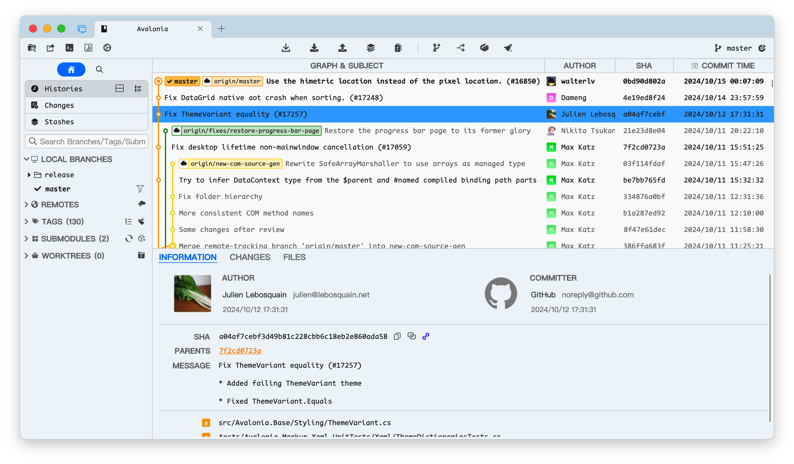

# SourceGit

开源的Git客户端，仅用于Windows。

## 下载

[发行版](https://gitee.com/sourcegit/SourceGit/releases/)

1. `SourceGit.exe`为不包含`.NET 5.0`运行时的可执行文件。如果本机已有`.NET 5.0`可下载使用
2. `SourceGit.zip`为`self-contained`包。包含了`.NET 5.0`运行时。 

## 预览

* DarkTheme

* LightTheme

## Thanks

* [PUMA](https://gitee.com/whgfu) 配置默认User
