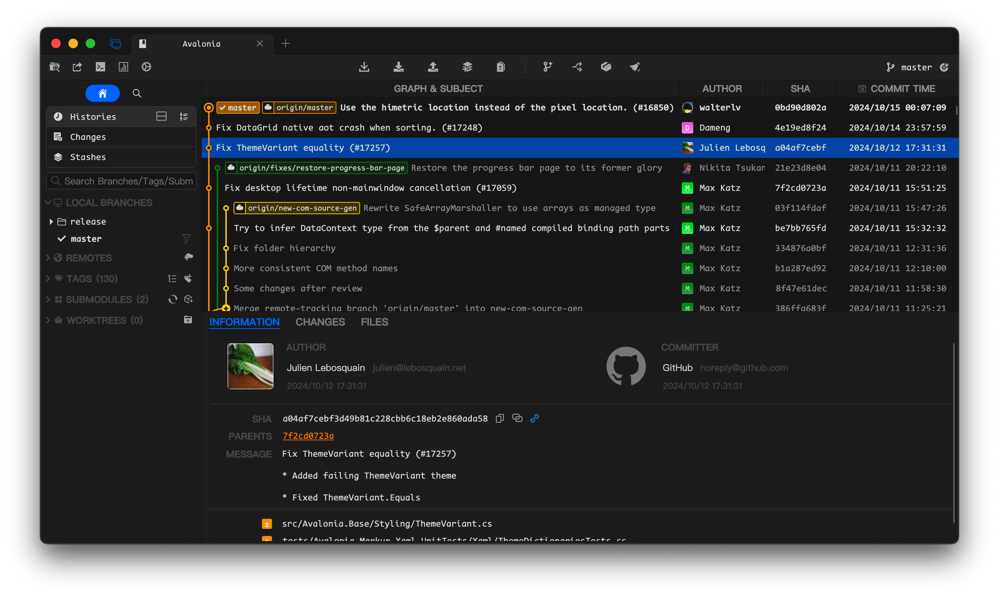

# SourceGit

Opensource Git GUI client.

## Highlights

* Supports Windows/macOS/Linux
* Opensource/Free
* Fast
* English/简体中文/繁體中文/German
* Built-in light/dark themes
* Customize theme
* Visual commit graph
* Supports SSH access with each remote
* GIT commands with GUI
  * Clone/Fetch/Pull/Push...
  * Merge/Rebase/Reset/Revert/Amend/Cherry-pick...
  * Interactive rebase (Basic)
  * Branches
  * Remotes
  * Tags
  * Stashes
  * Submodules
  * Worktrees
  * Archive
  * Diff
  * Save as patch/apply
  * File histories
  * Blame
  * Revision Diffs
  * Branch Diff
  * Image Diff - Side-By-Side/Swipe/Blend
* GitFlow support
* Git LFS support

> **Linux** only tested on **Debian 12** on both **X11** & **Wayland**.

## How to Use

**To use this tool, you need to install Git(>=2.23.0) first.**

You can download the latest stable from [Releases](https://github.com/sourcegit-scm/sourcegit/releases/latest) or download workflow artifacts from [Github Actions](https://github.com/sourcegit-scm/sourcegit/actions) to try this app based on latest commits.

This software creates a folder `$"{System.Environment.SpecialFolder.ApplicationData}/SourceGit"`, which is platform-dependent, to store user settings, downloaded avatars and crash logs.

| OS      | PATH                                            |
|---------|-------------------------------------------------|
| Windows | `C:\Users\USER_NAME\AppData\Roaming\SourceGit`  |
| Linux   | `${HOME}/.config/SourceGit`                     |
| macOS   | `${HOME}/Library/Application Support/SourceGit` |

For **Windows** users:

* **MSYS Git is NOT supported**. Please use official [Git for Windows](https://git-scm.com/download/win) instead.
* You can install the latest stable from `winget` with follow commands:
  ```shell
  winget install SourceGit
  ```
  > `winget` will install this software as a commandline tool. You need run `SourceGit` from console or `Win+R` at the first time. Then you can add it to the taskbar.
* You can install the latest stable by `scoope` with follow commands:
  ```shell
  scoop bucket add extras
  scoop install sourcegit
  ```
* Portable versions can be found in [Releases](https://github.com/sourcegit-scm/sourcegit/releases/latest)

For **macOS** users:

* Download `sourcegit_x.y.osx-x64.zip` or `sourcegit_x.y.osx-arm64.zip` from Releases. `x64` for Intel and `arm64` for Apple Silicon.
* Move `SourceGit.app` to `Applications` folder.
* Make sure your mac trusts all software from anywhere. For more information, search `spctl --master-disable`.
* Make sure [git-credential-manager](https://github.com/git-ecosystem/git-credential-manager/releases) is installed on your mac.
* You may need to run `sudo xattr -cr /Applications/SourceGit.app` to make sure the software works.

For **Linux** users:

* `xdg-open` must be installed to support open native file manager.
* Make sure [git-credential-manager](https://github.com/git-ecosystem/git-credential-manager/releases) is installed on your linux.
* Maybe you need to set environment variable `AVALONIA_SCREEN_SCALE_FACTORS`. See https://github.com/AvaloniaUI/Avalonia/wiki/Configuring-X11-per-monitor-DPI.

## External Tools

This app supports open repository in external tools listed in the table below.

| Tool                          | Windows | macOS | Linux | Environment Variable |
|-------------------------------|---------|-------|-------|----------------------|
| Visual Studio Code            | YES     | YES   | YES   | VSCODE_PATH          |
| Visual Studio Code - Insiders | YES     | YES   | YES   | VSCODE_INSIDERS_PATH |
| VSCodium                      | YES     | YES   | YES   | VSCODIUM_PATH        |
| JetBrains Fleet               | YES     | YES   | YES   | FLEET_PATH           |
| Sublime Text                  | YES     | YES   | YES   | SUBLIME_TEXT_PATH    |

* You can set the given environment variable for special tool if it can NOT be found by this app automatically.
* Installing `JetBrains Toolbox` will help this app to find other JetBrains tools installed on your device.
* On macOS, you may need to use `launchctl setenv` to make sure the app can read these environment variables.

## Screenshots

* Dark Theme

  

* Light Theme

  

* Custom

  You can find custom themes from [sourcegit-theme](https://github.com/sourcegit-scm/sourcegit-theme.git)

## Contributing

Thanks to all the people who contribute.

[](https://github.com/sourcegit-scm/sourcegit/graphs/contributors)
